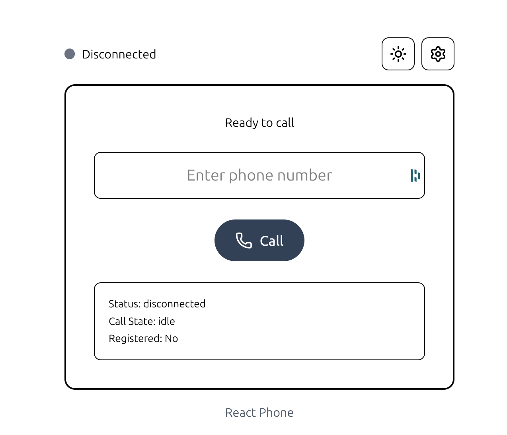

<div align="center">

# 📞 Modern WebRTC Phone

A modern, production-ready WebRTC softphone built with React 19, TypeScript, Tailwind CSS v4, and JsSIP.

[](https://opensource.org/licenses/MIT)
[](https://react.dev/)
[](https://www.typescriptlang.org/)
[](https://tailwindcss.com/)

[Features](#-features) • [Demo](#-demo) • [Installation](#-installation) • [Configuration](#-configuration) • [Contributing](#-contributing)

</div>

---

## 🎯 Overview

Modern WebRTC Phone is a fully-featured, browser-based softphone that enables voice calls over the internet using WebRTC technology. Built with the latest web technologies, it provides a clean, intuitive interface for making and receiving SIP calls directly from your browser—no plugins required.

**Perfect for:**

- Building custom VoIP solutions
- Integrating voice calling into web applications
- Creating customer support tools
- Learning WebRTC and SIP technologies
- Replacing legacy softphone applications

## ✨ Features

### Core Functionality

- 🎙️ **Crystal Clear Audio** - High-quality voice calls using WebRTC
- 📞 **Full Call Control** - Make, receive, answer, and hang up calls
- 🔇 **Mute/Unmute** - Control your microphone during calls
- 📊 **Real-time Status** - Live connection and call state indicators
- 🔄 **Auto-reconnect** - Automatic reconnection on network issues

### Technical Excellence

- ⚡ **Modern Stack** - React 19, TypeScript, Vite, Tailwind CSS v4
- 🎨 **Beautiful UI** - Clean, responsive design with smooth animations
- 💾 **Persistent Settings** - Configuration saved in localStorage
- 🐛 **Full Debug Logging** - Comprehensive console logging for troubleshooting
- 🔒 **Secure** - WebSocket Secure (WSS) support
- 🌐 **Standards Compliant** - Modern WebRTC APIs (ontrack, not deprecated onaddstream)
- 🎯 **STUN/TURN Support** - NAT traversal for reliable connections

### Developer Friendly

- 📦 **Zero Configuration** - Works out of the box
- 🔧 **Easy Customization** - Clean, modular code structure
- 📝 **TypeScript** - Full type safety and IntelliSense
- 🚀 **Fast Development** - Hot module replacement with Vite
- 📖 **Well Documented** - Comprehensive inline documentation

## 🎬 Demo



_A sleek, modern interface for browser-based calling_

## 📋 Requirements

### Browser Support

- ✅ Chrome/Edge 90+ (recommended)
- ✅ Firefox 88+
- ✅ Safari 14+ (with limitations)
- ✅ Opera 76+

### SIP Provider

You need a **WebRTC-compatible SIP provider** with WebSocket support:

#### ✅ Compatible Providers

- [Twilio](https://www.twilio.com/) - Enterprise-grade, excellent documentation
- [Plivo](https://www.plivo.com/) - Developer-friendly, competitive pricing
- [Bandwidth.com](https://www.bandwidth.com/) - Carrier-grade infrastructure
- [Vonage/Nexmo](https://www.vonage.com/) - Global reach
- **Self-hosted**: Asterisk, FreeSWITCH, Kamailio (with WebRTC configured)

#### ❌ Incompatible Providers

- VoIP.ms (no WebSocket/WebRTC support)
- Most traditional SIP providers without WebSocket endpoints

### System Requirements

- Node.js 18+ (for development)
- Modern web browser with WebRTC support
- Microphone access

## 🚀 Installation

### Quick Start

```bash
# Clone the repository
git clone https://github.com/3monthsfree/React-Phone.git
cd React-Phone

# Install dependencies
npm install

# Start development server
npm run dev
```

The application will be available at `http://localhost:5173`

### Production Build

```bash
# Build for production
npm run build

# Preview production build
npm run preview
```

The optimized build will be in the `dist/` directory, ready to deploy to any static hosting service.

## ⚙️ Configuration

### Initial Setup

1. Click the **Settings** icon (⚙️) in the top-right corner
2. Fill in your SIP credentials:

| Field                 | Description                | Example                         |
| --------------------- | -------------------------- | ------------------------------- |
| **Display Name**      | Your name for caller ID    | `Erik Bos`                      |
| **SIP URI**           | Your SIP address           | `sip:erik@sip.example.com`      |
| **Auth Username**     | Authentication username    | `erik` or `12345`               |
| **Password**          | Your SIP password          | `••••••••`                      |
| **WebSocket Server**  | WSS endpoint URL           | `wss://sip.example.com:8089/ws` |
| **STUN/TURN Servers** | ICE servers (one per line) | See below                       |

### STUN/TURN Server Configuration

**STUN Server Format:**

```
stun:stun.l.google.com:19302
```

**TURN Server Format:**

```
turn:turn.example.com:3478,username,password
```

**Multiple Servers:**

```
stun:stun.l.google.com:19302
stun:stun1.l.google.com:19302
turn:turn.example.com:3478,myuser,mypass
```

### Example Configurations

#### Twilio

```
Display Name: Your Name
SIP URI: sip:your-client-name@your-account.pstn.twilio.com
Auth Username: your-client-name
Password: your-auth-token
WebSocket Server: wss://your-account.pstn.twilio.com/ws
STUN/TURN: stun:global.stun.twilio.com:3478
```

#### Self-hosted Asterisk

```
Display Name: Your Name
SIP URI: sip:1001@asterisk.example.com
Auth Username: 1001
Password: your-secret
WebSocket Server: wss://asterisk.example.com:8089/ws
STUN/TURN: stun:stun.l.google.com:19302
```

## 📱 Usage

### Making a Call

1. **Configure Settings** - Enter your SIP credentials (one-time setup)
2. **Wait for Registration** - Green indicator shows "registered" status
3. **Enter Phone Number** - Type the destination number
4. **Click Call** - Initiate the call
5. **Talk** - Enjoy your conversation
6. **Hang Up** - End the call when finished

### Receiving a Call

1. **Stay Registered** - Keep the app open and registered
2. **Accept/Reject** - Browser prompt appears for incoming calls
3. **Answer** - Click "OK" to accept the call
4. **Talk** - Conversation begins automatically

### During a Call

- 🔇 **Mute/Unmute** - Click the microphone icon
- 📞 **Hang Up** - Click the red phone icon to end the call
- 📊 **Monitor Status** - Check call state in the debug panel

## 🐛 Debugging

The application includes comprehensive logging for troubleshooting:

### Console Logging

Open Browser DevTools (`F12` or `Cmd+Option+I`) to view:

- 🔌 **Connection Events** - WebSocket connection status
- 📝 **Registration Status** - SIP registration lifecycle
- 📞 **Call State Changes** - Detailed call progression
- 🌐 **WebRTC Details** - Peer connection and ICE candidates
- 🎵 **Media Tracks** - Audio stream information

### Debug Panel

The in-app debug panel shows:

- Current connection status
- Call state
- Registration status

### Common Issues

| Issue                  | Solution                                      |
| ---------------------- | --------------------------------------------- |
| "Not registered" error | Check SIP credentials and WebSocket URL       |
| No audio               | Check browser microphone permissions          |
| Connection fails       | Verify WebSocket server supports WSS          |
| Calls don't connect    | Check STUN/TURN server configuration          |
| One-way audio          | Verify NAT/firewall settings, add TURN server |

## 🏗️ Architecture

```
src/
├── App.tsx                 # Main application component
├── lib/
│   ├── sip-client.ts      # JsSIP wrapper and call management
│   └── utils.ts           # Utility functions
├── types/
│   └── sip.ts             # TypeScript type definitions
└── main.tsx               # Application entry point
```

### Key Technologies

- **React 19** - Latest React with concurrent features
- **TypeScript 5.9** - Type-safe development
- **Vite 7** - Lightning-fast build tool
- **Tailwind CSS 4** - Utility-first styling
- **JsSIP 3.10** - SIP/WebRTC library
- **Lucide React** - Beautiful icon set

## 🚧 Roadmap

Future enhancements planned:

- [ ] 📋 Call history with timestamps
- [ ] 👥 Contact management
- [ ] 🔢 DTMF tone support (dialpad during calls)
- [ ] 📹 Video call support
- [ ] 🎙️ Call recording
- [ ] 📞 Multiple simultaneous calls
- [ ] 🔔 Custom ringtones
- [ ] 📊 Call quality metrics
- [ ] 🌍 Internationalization (i18n)
- [ ] 📱 Progressive Web App (PWA)
- [ ] 🎨 Theme customization
- [ ] ⌨️ Keyboard shortcuts

## 🤝 Contributing

Contributions are welcome! This project is open source and community-driven.

### How to Contribute

1. **Fork the repository**
2. **Create a feature branch** (`git checkout -b feature/amazing-feature`)
3. **Commit your changes** (`git commit -m 'Add amazing feature'`)
4. **Push to the branch** (`git push origin feature/amazing-feature`)
5. **Open a Pull Request**

### Development Guidelines

- Follow the existing code style
- Add TypeScript types for new features
- Test thoroughly in multiple browsers
- Update documentation as needed
- Keep commits atomic and well-described

### Bug Reports

Found a bug? Please open an issue with:

- Browser and version
- Steps to reproduce
- Expected vs actual behavior
- Console logs (if applicable)

## 📄 License

This project is licensed under the **MIT License** - see the [LICENSE](LICENSE) file for details.

```
MIT License - Copyright (c) 2025 Erik Bos

Permission is hereby granted, free of charge, to any person obtaining a copy
of this software and associated documentation files (the "Software"), to deal
in the Software without restriction, including without limitation the rights
to use, copy, modify, merge, publish, distribute, sublicense, and/or sell
copies of the Software, and to permit persons to whom the Software is
furnished to do so, subject to the following conditions:

The above copyright notice and this permission notice shall be included in all
copies or substantial portions of the Software.
```

## 👨‍💻 Author

**Erik Bos**

- GitHub: [@3monthsfree](https://github.com/3monthsfree)
- Project: [React-Phone](https://github.com/3monthsfree/React-Phone)

## 🙏 Acknowledgments

Built with these amazing open-source projects:

- [React](https://react.dev/) - UI framework
- [Vite](https://vite.dev/) - Build tool
- [Tailwind CSS](https://tailwindcss.com/) - Styling
- [JsSIP](https://jssip.net/) - SIP/WebRTC library
- [Lucide Icons](https://lucide.dev/) - Icon set
- [TypeScript](https://www.typescriptlang.org/) - Type safety

---

<div align="center">

**⭐ Star this repository if you find it useful!**

Made with ❤️ by [Erik Bos](https://github.com/3monthsfree)

</div>
